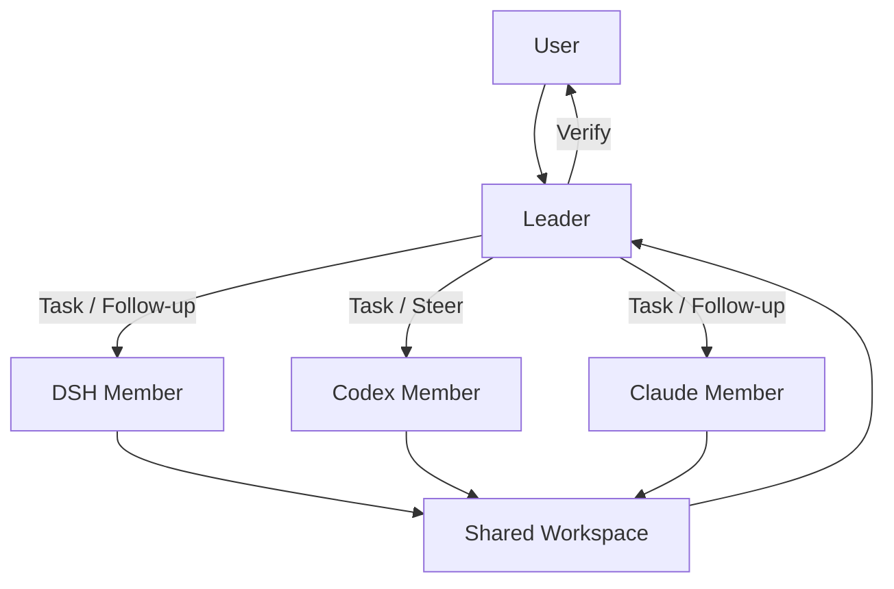

<div align="center">

# DSH Agent Groups

**Persistent AI Teams inside DeepSeek Harness**  
**让 Claude、Codex 与 DSH Agent 成为真正可持续协作的长期队友。**

[](https://github.com/YansIlinta/dsh-agent-groups/actions/workflows/ci.yml)
[](LICENSE)
[](https://github.com/YansIlinta/dsh-agent-groups/stargazers)
[](https://www.typescriptlang.org/)
[](https://github.com/deepseek-ai/DeepSeek-Harness)

[快速开始](#快速开始) · [核心能力](#核心能力) · [Runtime](#runtime) · [开发文档](docs/README.md) · [参与开发](CONTRIBUTING.md)

</div>

## 项目简介

DSH Agent Groups 是一个运行在 [DeepSeek Harness](https://github.com/deepseek-ai/DeepSeek-Harness) 内部的多 Agent 团队工作区。

它不把 Claude、Codex 或 DSH 子 Agent 当作一次性 worker，而是把每个成员建模成一个拥有 **持久 Runtime Session、任务历史、后续对话、排队工作与共享工作区上下文** 的长期队友。

Leader 可以拆解任务、把不同工作分配给不同 Runtime、继续追问或修正正在执行的成员，并在结果返回后统一验证。项目通过 DSH / Cordis 扩展接口接入，不修改或复制 DeepSeek Harness 源码。



## 核心能力

| 能力 | 说明 |
| --- | --- |
| **长期成员** | 同一个 Group Member 尽可能保持同一个 provider conversation，而不是每个任务重新启动一次性会话。 |
| **多 Runtime 团队** | 同一团队可组合 DeepSeek Harness、OpenAI Codex 与 Anthropic Claude。 |
| **Leader 编排** | Leader 负责拆分任务、分配成员、发送修正、验证结果与最终完成判定。 |
| **Session / Turn / Task 分离** | 进程、会话、Turn、任务是不同生命周期；进程退出不会被误判为任务成功。 |
| **Steer 与 Queue** | 忙碌成员不会并发执行两个 Turn；修正可以进入当前 Turn，无法实时 steer 时则进入同一 Session 的后续队列。 |
| **Durable State** | Group、Mission、Task、消息、Runtime 元数据、Artifact 与 Activity 持久保存。 |
| **原生 DSH UI** | Agent Groups 直接进入 DSH Sidebar 与 Shell，不使用 iframe，也不维护第二套应用外壳。 |
| **显式权限边界** | Leader ↔ Member 私聊允许；Member ↔ Member 私聊由 Host 服务层阻止，而不是只依赖 Prompt。 |

## 工作方式

一个成员对应一个长期 Runtime Session；任务和 Leader 后续指令对应 Session 内的多个 Turn。

```text
Group
└── Member
    └── Runtime Session
        ├── Turn 1  ← Task A
        ├── Turn 2  ← Leader follow-up / correction
        └── Turn 3  ← Task B
```

这意味着“把任务交给 Codex / Claude”不是一次命令调用，而是一段可以继续对话、继续修正、继续执行后续任务的成员关系。

## Runtime

| Runtime | 会话身份 | 多轮方式 | 主要能力 |
| --- | --- | --- | --- |
| **DeepSeek Harness** | DSH member session | 原生成员 Session | DSH 模型 / Reasoning、父子 Session、长期成员 |
| **Codex** | Codex App Server thread | 同一 thread 多个 turn | `turn/start`、`turn/steer`、interrupt、approval、resume |
| **Claude** | Claude Agent SDK session id | `options.resume` 延续 Session | 多轮 query、streaming、interrupt、resume |

Runtime Provider 对外暴露统一的 Session / Turn contract，并把 provider-specific 事件归一化为 Host 可以理解的状态。

更详细的生命周期与约束见 [架构说明](docs/architecture.md)。

## 原生 DSH 界面

Agent Groups 通过 DSH Client Plugin 机制嵌入现有界面：

- `sidebar.footer.action`：在原生 Sidebar 增加 **Agent Groups** 入口；
- `shell.overlay`：承载完整工作区，同时保留 DSH Shell、Theme 与导航；
- 直接复用 DSH UI primitives 与 `--dsw-alias-*` Theme Tokens；
- 项目本地样式统一使用 `ag-` 前缀，避免污染宿主界面；
- `/groups/api/*` 提供数据接口，`/groups/api/events` 通过 SSE 推送实时状态。

当前工作区包含 Group Overview、Tasks、Team / Runtime State、Channel、Leader Chat、Workspace、Activity、Profiles 与 Team Config。

详见 [Native UI](docs/native-ui.md)。

## 快速开始

### 环境要求

- Node.js **20+**（推荐 Node.js 22）
- 本地 DeepSeek Harness
- Bash（用于当前 Web Profile 安装 / 重启脚本）
- 可选：已登录的 `codex` CLI，用于 Codex Member
- 可选：可用的 Claude / Claude Agent SDK 环境，用于 Claude Member

> [!NOTE]
> 当前 CI 固定验证 DeepSeek Harness `0.1.0-rc.6`。其他 DSH 版本需要单独做兼容性验证后再视为正式支持。

### 构建

```bash
git clone https://github.com/YansIlinta/dsh-agent-groups.git
cd dsh-agent-groups

cd packages/host
npm install
cd ../..

npm run build
npm run typecheck
npm test
```

### 安装到 DSH Web Profile

```bash
npm run install-web-profile
npm run relaunch-web
```

安装脚本会构建 Native Client Bundle、把 `@dsh-agent-groups/host` 安装到本地 DSH Profile Module Tree，并安装 `group-leader` / `group-member` Preset。

DSH 重启后，在原生 Sidebar 底部打开 **Agent Groups** 即可进入工作区。

## 基本使用流程

1. 创建或打开一个 **Agent Group · Team Lead** Session。
2. 在 **Agent Groups** 中新建 Group。
3. 选择 Team Template，或手动配置不同角色对应的 Runtime / Model / Reasoning。
4. 输入 Mission。
5. Leader 将 Mission 拆成 Tasks，并分配给 DSH / Codex / Claude Member。
6. 在 Tasks、Team、Channel、Leader Chat、Workspace 与 Activity 中跟踪执行。
7. 对正在工作的成员发送 correction、排队后续任务、处理 approval / input，或中断当前 Turn。
8. Leader 验证成员结果后，再决定是否完成 Task 与 Mission。

## 项目状态

DSH Agent Groups 目前处于快速迭代阶段。

Persistent Session / Multi-runtime 基础模型已经落地；当前重点是继续加强长程执行的可靠性，包括：

- queued turn 在 Host 重启后的完整持久化与恢复；
- active task 与 queued task 的严格状态分离；
- transient turn-start failure 的确定性 retry；
- 新版 DeepSeek Harness 的 compatibility matrix；
- Native UI 与 DSH 当前交互细节进一步对齐。

因此当前仓库更适合开发、实验和真实 Runtime 验证，而不是被视为已经稳定冻结的最终产品。

## 开发

仓库根目录常用命令：

```bash
npm run build
npm run typecheck
npm test
npm run build:native
```

涉及 Runtime / Durability 的改动，除单元测试外应尽量补充最小真实集成验证。

```bash
node scripts/verify-durability.mjs
node scripts/demo-v02.mjs
```

完整说明见 [Development Guide](docs/development.md)。如果使用 Coding Agent 修改仓库，请先阅读 [AGENTS.md](AGENTS.md)。

## 仓库结构

```text
.
├── .github/                # CI、Issue / PR 协作配置
├── docs/                   # 架构、开发、UI 与 Runtime 协议文档
├── packages/
│   ├── host/               # Host 服务、Runtime、API、Native Client
│   └── profiles/           # group-leader / group-member presets
├── scripts/                # build、install、relaunch、demo、durability helpers
├── AGENTS.md               # Coding Agent 工作规则与核心 invariants
├── CONTRIBUTING.md         # 贡献流程与验证要求
├── LICENSE
└── README.md
```

`packages/host/src/` 的主要边界：

| 路径 | 职责 |
| --- | --- |
| `group-host.ts` | 产品 Facade、Leader / Member 操作与 Runtime 协调 |
| `group-service.ts` | Group / Member 生命周期 |
| `task-service.ts` | Task DAG 与任务状态 |
| `channel-service.ts` | Channel / Private Message |
| `runtime/` | DSH / Codex / Claude Provider 与 Session / Turn 抽象 |
| `native-client/` | DSH 原生 Agent Groups UI |
| `web/` | HTTP API + SSE |
| `persistence.ts` / `store.ts` | Durable Schema 与存储适配 |

## 文档

更深入的工程说明统一放在 `docs/`，避免 README 逐渐变成实现日志。

- [文档索引](docs/README.md)
- [Architecture & Invariants](docs/architecture.md)
- [Development Guide](docs/development.md)
- [Native UI Integration](docs/native-ui.md)
- [Codex App Server Protocol](docs/CODEX_APP_SERVER_PROTOCOL.md)

版本演进、历史方案与修复记录以 Git History、Pull Request 和 Issue 为准。

## 参与开发

Bug 报告、真实 Runtime 兼容性结果、回归测试和小而明确的 Pull Request 都很有价值。

涉及 Session / Turn / Task 状态机时，请优先保护生命周期 invariant，而不是为了统一 API 而伪造 provider 不具备的能力。提交前请阅读 [CONTRIBUTING.md](CONTRIBUTING.md)。

## 致谢

- [DeepSeek Harness](https://github.com/deepseek-ai/DeepSeek-Harness)
- [OpenAI Codex](https://github.com/openai/codex)
- [Claude Agent SDK](https://github.com/anthropics/claude-agent-sdk-typescript)

同时感谢所有参与真实 Runtime 测试、问题定位与架构讨论的开发者。

## 许可证

本项目基于 [MIT License](LICENSE) 开源。
